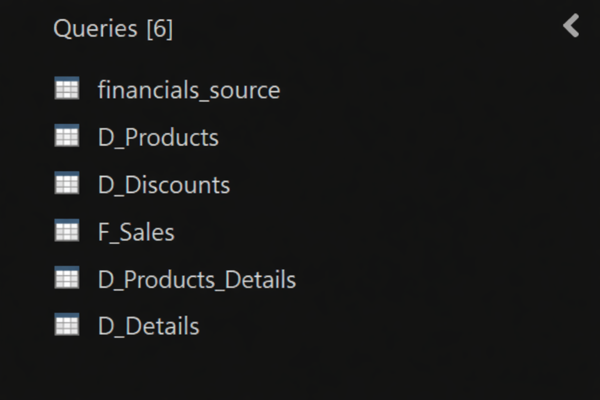
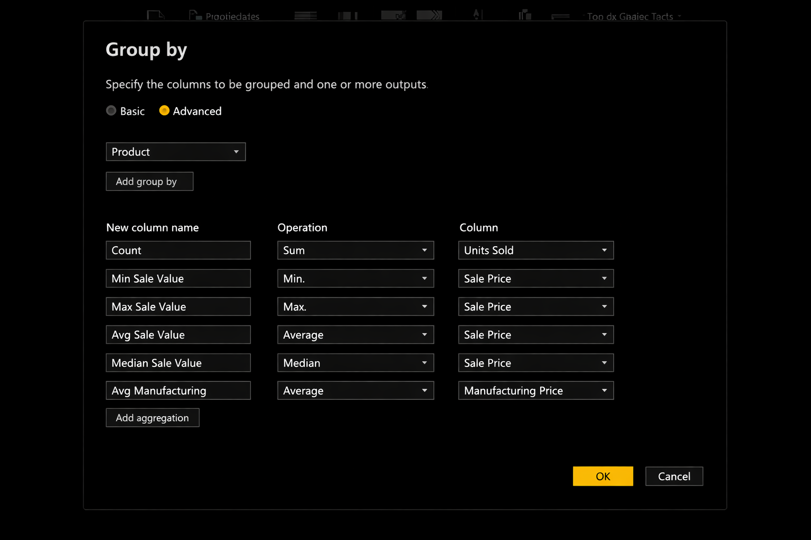
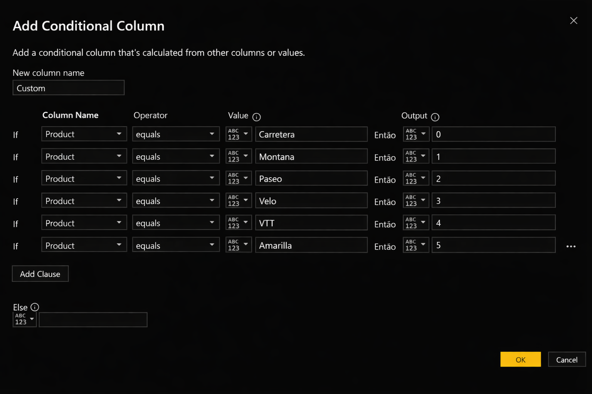
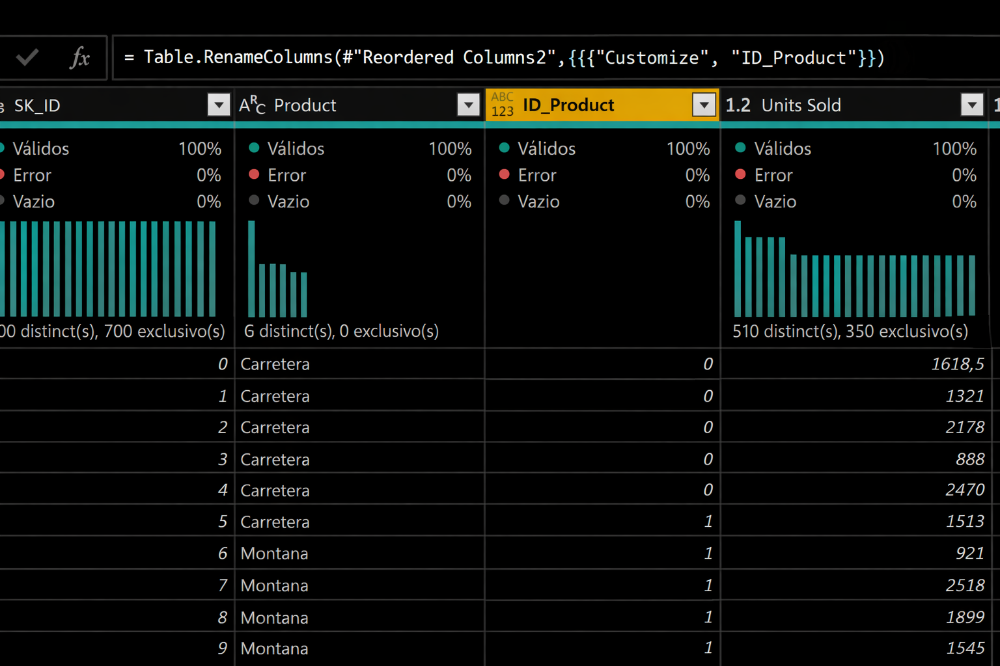
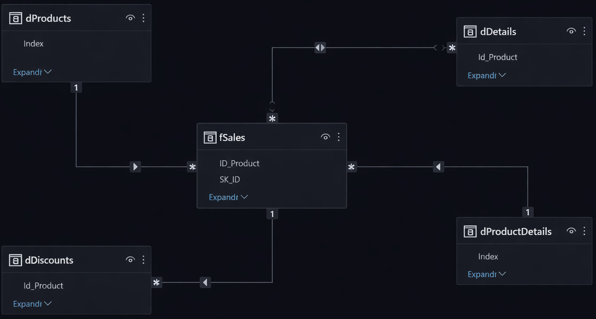

Daily learning

# Modeling an E-commerce Dashboard with Power BI Using DAX Formulas

Project developed at the Bootcamp Power BI Analyst Training, under the guidance of specialist [Juliana Zanelatto](https://github.com/julianazanelatto/ "Juliana Zanelatto").

Project Challenge Description:

We will use the single Financial Sample table to create the dimension and fact tables for our star schema-based model.

The process consists of creating the tables based on the original table. From the copy,
the columns that will compose the view of the new table will be selected.
Therefore, the following tables will be created from the main table:

Financials_origem (hidden mode – backup)

- D_Products (Product_ID, Product, Average Units Sold, Average Sales Value, Median Sales Value,
Maximum Sales Value, Minimum Sales Value)
- D_Products_Details (Product_ID, Discount Band, Sale Price, Units Sold, Manufacturing Price)
- D_Discount (Product_ID, Discount, Discount Band)
- D_Details (*)
- D_Calendar – Created by DAX with calendar()
- F_ales (SK_ID, Product_ID, Product, Units Sold, Sales Price, Discount Band, Segment, Country, Salers, Profit, Date (fields))

*Check the information that was not included in the other dimension tables that provide more details about sales.

Example of a table created by grouping the information.

Example of a column being built from a conditional statement – ​​Product Index

Reorganize the columns

You can use the following points as a basis:

- Save the .pbix project
- Save an image of your star schematic
- Write in the readme the process of building your diagram
- Talk about the steps, functionalities and DAX functions used in this project.

Star Schema

[LICENSE](/LICENSE)

See [original repository](https://github.com/julianazanelatto/power_bi_analyst).
